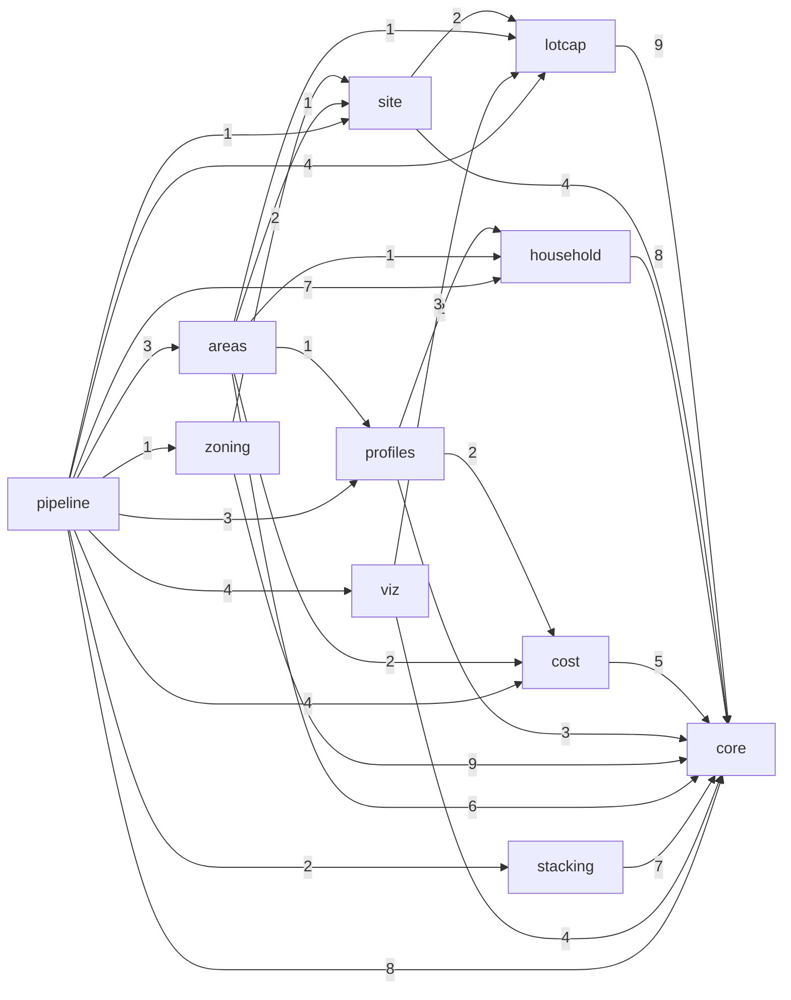

# Arquitectura modular de `spaceplan`

> Documento **generado** por `python tools/module_graph.py write` desde las importaciones del código y
> los esquemas de contratos; `tests/pipeline/test_docs.py` falla si queda desactualizado.

## Grafo de módulos (importaciones reales)

Cada flecha `A --> B` significa que algún archivo de A importa B (el número es la cantidad de archivos).

| Módulo | Importa | Importado por |
|---|---|---|
| `core` | — | lotcap, site, household, cost, profiles, zoning, areas, stacking, viz, pipeline |
| `lotcap` | core | site, areas, viz, pipeline |
| `site` | core, lotcap | zoning, areas, pipeline |
| `household` | core | profiles, areas, pipeline |
| `cost` | core | profiles, areas, pipeline |
| `profiles` | core, household, cost | areas, pipeline |
| `zoning` | core, site | pipeline |
| `areas` | core, lotcap, site, household, cost, profiles | pipeline |
| `stacking` | core | pipeline |
| `viz` | core, lotcap | pipeline |
| `pipeline` | core, lotcap, site, household, cost, profiles, zoning, areas, stacking, viz | — |

## Archivos por módulo y capa

| Módulo | `main/` | `lib/` | `lib_aux/` |
|---|---|---|---|
| `core` | — | `catalog`, `contracts`, `enums`, `registry`, `relation_graph`, `rules`, `schema_validation` | `allocation`, `geometry`, `hashing`, `json_io`, `knee`, `pareto`, `predicates`, `quantity`, `section`, `tolerances`, `weighted` |
| `lotcap` | `contract`, `run_lotcap` | `boundaries`, `capacity`, `flag_lot`, `lot`, `lot_metrics`, `rule_variants`, `scope` | — |
| `site` | `contract`, `run_site` | `backyard`, `orientation`, `site_partition` | — |
| `household` | `contract`, `run_household`, `run_program` | `culture`, `household`, `household_catalog`, `household_rules`, `program_builder`, `program_review` | — |
| `cost` | `contract`, `run_cost` | `budget`, `cost_models`, `cost_sensitivity`, `quantities` | — |
| `profiles` | `contract`, `run_profiles` | `program_profiles` | — |
| `zoning` | `contract`, `run_corrections`, `run_zoning` | `band_enumeration`, `circulation`, `corrections`, `polygonal`, `realization`, `relation_matrix`, `space_layout`, `unit`, `zoning` | — |
| `areas` | `contract`, `run_area_matrix` | `area_budget`, `area_matrix`, `building_indices`, `vertical_split` | — |
| `stacking` | `contract`, `run_stacking` | `cell_selection`, `height_check`, `levels`, `lot_vertical`, `stacking_catalog`, `vertical_rules` | `vertical_geometry` |
| `viz` | `run_viz` | `area_matrix_plots`, `lot_site_plots`, `portfolio_sheet`, `review_notes`, `review_sheets`, `zoning_plots` | — |
| `pipeline` | `cli`, `run_area_analysis`, `run_capacity`, `run_catalog`, `run_household_report`, `run_modules`, `run_portfolio` | `catalog_table`, `package` | — |

## Contratos (versión 0.2.0)

Sobre común: `contract`, `version`, `produced_by`, `input_sha256` (SHA-256 de las entradas que leyó el
productor), `brief_id` y `consumers` (informativos). Esquemas en `spaceplan/contracts/schemas/`.

| Contrato | Produce | Consumen | Bloques obligatorios | Opcionales |
|---|---|---|---|---|
| `lot_capacity` | `lotcap` | site, zoning, areas, cost, viz, pipeline | `lot`, `scope`, `lot_metrics`, `boundaries`, `rule_variants`, `lot_conformity`, `capacity`, `realizable_capacity`, `sensitivity` | `warnings`, `terrain`, `realization_strategy` |
| `site_plan` | `site` | zoning, areas, cost, viz, pipeline | `site_partition` | `warnings` |
| `program` | `household` | profiles, zoning, cost, pipeline | `program`, `program_review` | `household` |
| `cost_report` | `cost` | profiles, areas, pipeline | `cost` | — |
| `program_portfolio` | `profiles` | areas, viz | `reading`, `model`, `ceilings`, `household`, `curve`, `profiles` | `legend`, `quality_note`, `sheets` |
| `zoning_scheme` | `zoning` | viz, pipeline | `zoning` | `unit`, `corrections`, `dwelling_type`, `realization_strategy` |
| `area_matrix` | `areas` | viz, stacking | `meta`, `lots`, `cells` | `figures` |
| `stack_plan` | `stacking` | viz, pipeline | `meta`, `lots`, `cells` | `figures` |

Cada productor tiene `modules/<m>/main/contract.py` con `to_contract` (valida al producir) y
`from_contract` (valida al leer). El `pipeline` arma el paquete solo desde los contratos
(`pipeline/lib/package.py:package_from_contracts`), `cost` lee `lot_capacity`, `site_plan` y `program`
como JSON y `viz` dibuja desde los contratos.

## Cómo agregar un módulo

Registro único: `spaceplan/core/lib/registry.py` (módulos, importaciones permitidas, contratos con productor y
consumidores); todas las listas del código, las pruebas y las herramientas se derivan de ahí.

1. `python tools/new_module.py <m> --contract <contrato> --deps core,<módulos> --consumers viz,pipeline
   --title "Step X.Y ..."`: crea `modules/<m>/{main,lib,lib_aux}`, `main/run_<m>.py`, `main/contract.py`
   (`to_contract` / `from_contract`), el esquema base `contracts/schemas/<contrato>.schema.json`, la prueba base
   `tests/<m>/` y la entrada del registro (`--dry-run` para ver la lista).
2. Dominio en `lib/`, utilidades sin dominio en `lib_aux/`, workflow en `main/`; bloques del contrato en el esquema
   (Draft 2020-12; `$ref` al paquete o al brief cuando existan). Números normativos en `data/rules`, parámetros de
   diseño en un catálogo con fuente y estado.
3. Componerlo en `pipeline/main/run_modules.py` (nunca desde el `main/` de otro módulo) y agregar el subcomando en
   `pipeline/main/cli.py`.
4. Contrato fijo: agregar el caso a `tools/make_fixtures.py` y correr `python tools/make_fixtures.py write`.
5. `python tools/module_graph.py write`; mientras se desarrolla: `python tools/dev_check.py quick <m>`; al cerrar el
   paso: `python tools/dev_check.py full`.
