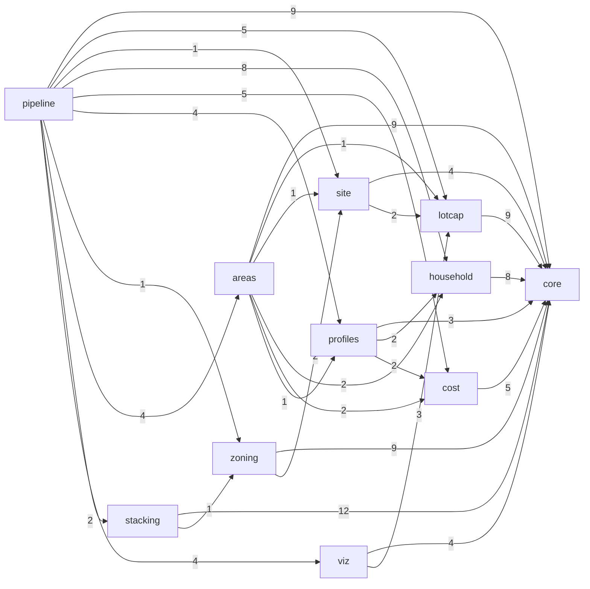

# Arquitectura modular de `spaceplan`

> Documento **generado** por `python tools/module_graph.py write` desde las importaciones del código y
> los esquemas de contratos; `tests/pipeline/test_docs.py` falla si queda desactualizado.

## Grafo de módulos (importaciones reales)

Cada flecha `A --> B` significa que algún archivo de A importa B (el número es la cantidad de archivos).

| Módulo | Importa | Importado por |
|---|---|---|
| `core` | — | lotcap, site, household, cost, profiles, zoning, areas, stacking, viz, pipeline |
| `lotcap` | core | site, areas, viz, pipeline |
| `site` | core, lotcap | zoning, areas, pipeline |
| `household` | core | profiles, areas, pipeline |
| `cost` | core | profiles, areas, pipeline |
| `profiles` | core, household, cost | areas, pipeline |
| `zoning` | core, site | stacking, pipeline |
| `areas` | core, lotcap, site, household, cost, profiles | pipeline |
| `stacking` | core, zoning | pipeline |
| `viz` | core, lotcap | pipeline |
| `pipeline` | core, lotcap, site, household, cost, profiles, zoning, areas, stacking, viz | — |

## Archivos por módulo y capa

| Módulo | `main/` | `lib/` | `lib_aux/` |
|---|---|---|---|
| `core` | — | `catalog`, `contracts`, `design_variables`, `enums`, `relation_graph`, `rules`, `schema_validation` | `allocation`, `geometry`, `hashing`, `json_io`, `knee`, `pareto`, `predicates`, `quantity`, `section`, `tolerances`, `weighted` |
| `lotcap` | `contract`, `run_lotcap` | `boundaries`, `capacity`, `flag_lot`, `lot`, `lot_metrics`, `rule_variants`, `scope` | — |
| `site` | `contract`, `run_site` | `backyard`, `orientation`, `site_partition` | — |
| `household` | `contract`, `run_household`, `run_program` | `culture`, `household`, `household_catalog`, `household_rules`, `program_builder`, `program_review` | — |
| `cost` | `contract`, `run_cost` | `budget`, `cost_models`, `cost_sensitivity`, `quantities` | — |
| `profiles` | `contract`, `run_profiles` | `program_profiles` | — |
| `zoning` | `contract`, `run_corrections`, `run_zoning` | `band_enumeration`, `circulation`, `corrections`, `polygonal`, `realization`, `relation_matrix`, `space_layout`, `unit`, `zoning` | — |
| `areas` | `contract`, `run_area_matrix` | `area_budget`, `area_matrix`, `building_indices`, `floor_balance`, `lot_minimum`, `sensitivity`, `vertical_split` | — |
| `stacking` | `contract`, `run_stacking` | `access_core`, `access_rank`, `access_stair`, `cell_geometry`, `cell_selection`, `core_zoning`, `floor_frame`, `height_check`, `levels`, `lot_plan`, `lot_vertical`, `plan_levels`, `roof_plane`, `routes`, `stacking_catalog`, `stair`, `stair_access`, `stair_rules`, `vertical_rules`, `zone_cell`, `zone_relations` | `plan_geometry`, `stair_geometry`, `vertical_geometry`, `zone_grid` |
| `viz` | `run_viz` | `area_matrix_plots`, `lot_site_plots`, `portfolio_sheet`, `review_notes`, `review_sheets`, `sensitivity_plots`, `stack_plan_plots`, `zoning_plots` | — |
| `pipeline` | `cli`, `run_area_analysis`, `run_capacity`, `run_catalog`, `run_household_report`, `run_modules`, `run_portfolio`, `run_sensitivity` | `catalog_table`, `package` | — |

## Contratos (versión 0.2.0)

Sobre común: `contract`, `version`, `produced_by`, `input_sha256` (SHA-256 de las entradas que leyó el
productor), `brief_id` y `consumers` (informativos). Esquemas en `spaceplan/contracts/schemas/`.

| Contrato | Produce | Consumen | Bloques obligatorios | Opcionales |
|---|---|---|---|---|
| `lot_capacity` | `lotcap` | site, zoning, areas, cost, viz, pipeline | `lot`, `scope`, `lot_metrics`, `boundaries`, `rule_variants`, `lot_conformity`, `capacity`, `realizable_capacity`, `sensitivity` | `warnings`, `terrain`, `realization_strategy` |
| `site_plan` | `site` | zoning, areas, cost, viz, pipeline | `site_partition` | `warnings` |
| `program` | `household` | profiles, zoning, cost, pipeline | `program`, `program_review` | `household` |
| `cost_report` | `cost` | profiles, areas, pipeline | `cost` | — |
| `program_portfolio` | `profiles` | areas, viz | `reading`, `model`, `ceilings`, `household`, `curve`, `profiles` | `legend`, `quality_note`, `sheets` |
| `zoning_scheme` | `zoning` | viz, pipeline | `zoning` | `unit`, `corrections`, `dwelling_type`, `realization_strategy` |
| `area_matrix` | `areas` | viz, stacking | `meta`, `lots`, `cells` | `figures` |
| `stack_plan` | `stacking` | viz, pipeline | `meta`, `lots`, `cells` | `figures` |

Cada productor tiene `modules/<m>/main/contract.py` con `to_contract` (valida al producir) y
`from_contract` (valida al leer). El `pipeline` arma el paquete solo desde los contratos
(`pipeline/lib/package.py:package_from_contracts`), `cost` lee `lot_capacity`, `site_plan` y `program`
como JSON y `viz` dibuja desde los contratos.

## Cómo agregar un módulo (p. ej. `stacking`, paso 6.7)

1. Crear `spaceplan/modules/<m>/{__init__,main/__init__,lib/__init__,lib_aux/__init__}.py`: `lib/` funciones de
   dominio, `lib_aux/` utilidades sin dominio, `main/` el workflow del módulo.
2. Declarar sus dependencias permitidas en `ALLOWED` de `tests/pipeline/test_architecture.py` (el grafo debe seguir
   siendo acíclico) y sus archivos en `test_files_follow_plan_table`.
3. Escribir su contrato: `spaceplan/contracts/schemas/<contrato>.schema.json` (Draft 2020-12, sobre común,
   bloques por `$ref` al paquete o al brief cuando existan), agregarlo a `CONTRACTS`
   (`core/lib/schema_validation.py`) y a `PRODUCERS`/`CONSUMERS` (`core/lib/contracts.py`).
4. `modules/<m>/main/contract.py` con `NAME`, `to_contract(...)` (usa `make_contract`, que valida) y
   `from_contract(contract)` (usa `read_contract`). Serializar como el paquete: `package_json` para los bloques que
   el paquete redondea, `plain_json` para los que lleva tal cual.
5. Componerlo en `pipeline/main/` (nunca desde el `main/` de otro módulo); si alimenta el paquete, leerlo con
   `read_contract` en `pipeline/lib/package.py`.
6. CLI: subcomando en `pipeline/main/cli.py` que lea y escriba el contrato.
7. Pruebas en `tests/<m>/` con contratos fijos en `tests/<m>/fixtures/` (agregar el caso a
   `tools/make_fixtures.py`, que los verifica contra la instantánea dorada).
8. Regenerar este documento: `python tools/module_graph.py write`.
